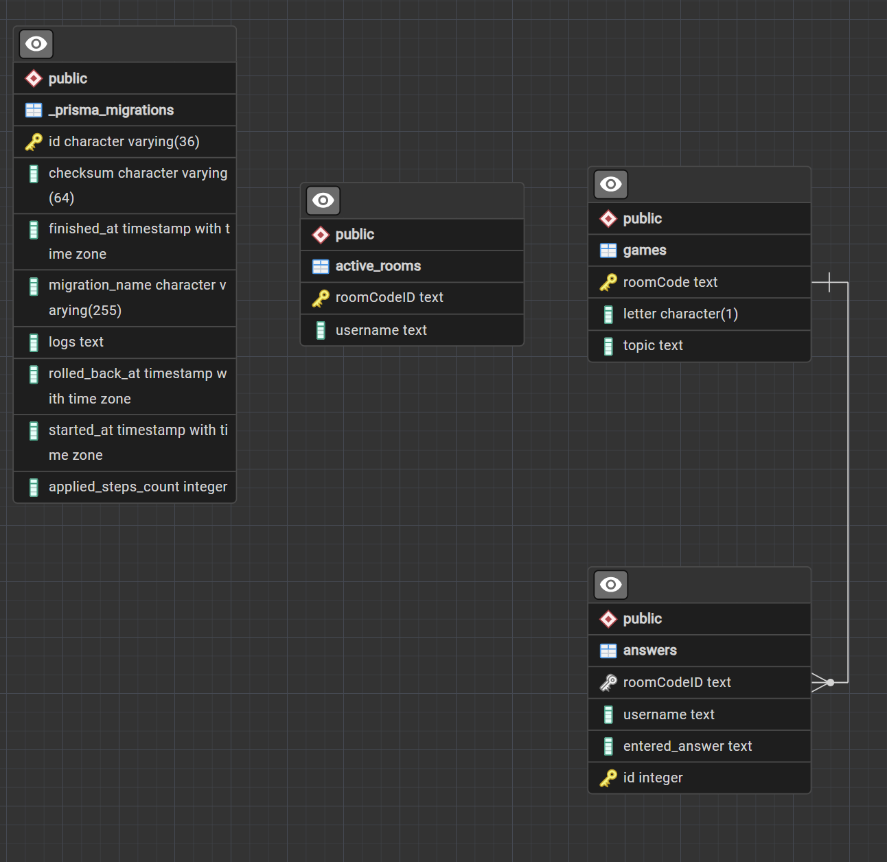

# Scattergories

#### General notes as a starting point: [Scattergories_notes.pdf](https://github.com/user-attachments/files/29338468/Scattergories_notes.pdf)

### Collaborators:

1. **Isaiah** [ikingdlc](https://github.com/ikingdlc)
2. **Ramanpreet** [Ramanpreet8 (Ramanpreet)](https://github.com/Ramanpreet8)
3. **Yasmine** [YasmineRaef (Yasmine_Raef_M.) · GitHub](https://github.com/YasmineRaef)

### Project:

Create an Express API Server (Prisma + PostgreSQL) with at least _three_ routes:

- **_POST_** `"/games"` : Create an ew `roomCode` game with a `letter` and a `topic`.
  -> The user creates a new game, the server validates the new `roomCode`, checks the database to make sure there are no duplicates, then creates a new game and saves it to the PostgreSQL database server.
- **_GET_** `"/games"` : Retrieves all the current games in the database and displays it to the user in a JSON format.
  -> The user asks for all the current games in the database, all the games records should be echoed in the localhost:3000 server including the `roomCode`, `letter`, and the `topic` of the game.
- **_GET_** `"/answer/"` : User types in the answer they have for the game, user should provide the `roomCode`, their `username`, and the answer they want to submit.
  -> The user tries to submit an answer to that specific game associated with the provided `gameCode`, the server should verify th following:
  a. The `roomCode` actually exists. Otherwise prompt the user to create the game first.
  b. The answer entered by the user should start with the `letter` associated with that specifc `roomCode`.

```js
//In the database we have:
{roomCode: "ABC123", letter: "S", topic: "sports"}
{roomCode: "AN123", letter: "D", topic: "animals"}
//The user entered the following as a probable answer:
{roomCode: "ABC123", username: "Username", answer: "soccer"} //--> Here the server should accept it as the answer starts with an 'S', and in the database, that game has the `letter` given S too.

//Example of rejected cases:
{roomCode: "ABC123", username: "Username", answer: "basketball"} //doesn't start with S
{roomCode: "ABCI23", username: "Username", answer: "soccer"} //Game Code doesn't exist in the db
```

---

### Built:

1. Created a prisma _boilerplate_ with the following commands:
   -> This setup is completely documented here: [citytech-ttpr-2026-summer/slides/2026-06-24.pdf at main · jonathan-chin/citytech-ttpr-2026-summer](https://github.com/jonathan-chin/citytech-ttpr-2026-summer/blob/main/slides/2026-06-24.pdf)

```bash
- yarn set version berry
- yarn init -y
- echo "nodeLinker: node-modules" >> .yarnrc.yml
- yarn add prisma @prisma/client @prisma/adapter-pg dotenv
- yarn add -D typescript ts-node-dev @types/node
- yarn tsc --init

```

2. Created a database with **PostgreSQL** having the following ERD:
   

3. Exported the database _scheme and data_ and uploaded the dumfile in the `/data` folder.

4. Restructured the project to include _Typescript_ debugging with `yarn tsc`.

5. Added **Express** to create routes using `yarn add express`.

6. Created 2 functions for generating random letters and topics.

```js
const getRandomLetter = () =>
  String.fromCharCode(65 + Math.floor(Math.random() * 26));

const getRandomTopic = () => {
  const topics = [
    "Object",
    "Plants",
    "Animals",
    "Country",
    "Programming Concept",
    "Colors",
    "Sports",
    "Food",
  ];
  return topics[Math.floor(Math.random() * topics.length)];
};
```

7. Built a function that inserts data/records in the games table to separate _prisma database logic_ from input validation and server status codes.

```js
const insertGame = async (roomID: string) => {
  try {
    return await prisma.games.create({
      data: {
        roomCode: roomID,
        letter: getRandomLetter(),
        topic: getRandomTopic(),
      },
    });
  } catch (error) {
    console.error("Failed to insert game: ", error);
  }
};
```

8. Created a `"/games"` _POST_ route for the user to add a new game with providing a **valid roomCode**.

```js
app.post("/games", async (req, res) => {
  try {
    const { roomCode } = req.body;
    if (!roomCode || roomCode.trim() === "") {
      console.log("No roomCode provided...");
      return res.status(400).json({
        message: "Please enter a room code to start. (i.e. json body)",
      });
    }
    if (typeof roomCode !== "string") {
      console.log("provided roomCode is not a string...");
      return res.status(400).json({
        message:
          "Please enter a valid room code containing a combination of numbers and characters. (e.g. Test123)",
      });
    }
    if (roomCode.length < 4 || roomCode.length > 6) {
      console.log("roomCode length is <= 3...");
      return res.status(400).json({
        message: "roomCode must be between 4 and 6 characters.",
      });
    }

    const newGame = await insertGame(roomCode);

    return res.status(201).json({
      message: "New Game created successfully!",
      game: newGame,
    });
  } catch (error) {
    console.log("User did not provide a req json body...");
    return res.status(500).json({
      message: "Please provide a roomCode in a json body.",
    });
  }
});
```

9. Created a `"/games"` _GET_ route for the user to list and see all the previously created games from the games table.
```js
app.get("/games", async (req,res) => {
 try {
   const games = await prisma.games.findMany();
  console.log("Games:", games); 
  if(!games || games.length === 0){
    console.log("Games table empty...");
    return res.status(404).json({message: "No games created yet. Please create a game first..."});

  }

 return res.status(200).json({message: "Retreiving game data...", games:games});
 }
 catch(e){
  console.log("Database connection error...");
  return res.status(500).json({message: "INternal server error ..."});
 }

})
```
10. Created a `"/answers"` _POST_ route for the user to add an answer by inputting the user's `username`, `roomCode` and the `answer`. The server checks if the answer starts with the letter associated with the roomCode and returns a specific message.
```js
app.post("/answers", async (req, res) => {
  try {
    const {roomCode, username, answer} = req.body;
    let index = 0;
    const games = await prisma.games.findMany();
    console.log(games[0].roomCode);
    for (let i = 0; i < games.length; i ++){
      if (!games[i].roomCode === roomCode) {
        console.log("The game doesn't exist");
        return res.status(400).json({message:"no game with this room code"});
  
      }
      if (games[i].roomCode === roomCode) {
        index = i;
        break ; 
    }}
    const letter = games[index].letter;
    if(answer.includes(" ")){
      console.log("answer has spaces");
      return res.status(400).json({message:"Answer must be only one word"});
    }
    const lower = answer.toUpperCase();

    if (!lower.startsWith(letter)){
      console.log("answer doesn't start with required letter");
      return res.status(400).json({message:`Answer must start with ${letter}`});
    }
    const newAnswer = await insertAnswer(roomCode, answer, username);
    const active_rooms = await activeRooms(roomCode, username);
    return res.status(200).json({message:"the answer is created successfully", answer: newAnswer, confirmation: activeRooms})


  } catch (error) {
    console.log (error);
  }

});
```
11. Created a function to add/write the acceptable answer in the answers table along with the active_rooms table.
```js
const insertAnswer = async (roomID: string, answer: string, username: string) => {
  try {
    return await prisma.answers.create({
      data: {
        roomCodeID: roomID,
        username: username,
        entered_answer: answer
      },
    });
  } catch (error) {
    console.error("Failed to insert answer: ", error);
  }
};

const activeRooms = async (roomID: string, username: string) => {
  try {
    return await prisma.active_rooms.create({
      data: {
        roomCodeID: roomID,
        username: username,
      },
    });
  } catch (error) {
    console.error("Failed to insert active games: ", error);
  }
};
```

---

### To do:

1. Adding error handling and user inputs when a user tries to add an answer to a roomCode where someone is already in that game.
2. Creating a `"/logout"` route, so the users can logout of the current game and other users could access it afterwards. (i.e. deletes the record from the active_rooms table)
3. Optional: Creating a `cosole.log` function that echos the data in each table for debugging purposes **developer's testing**.

---

### Cloning:

###### Disclaimer: These steps where guided by copilot when prompted:

_Provide the cleanest step-by-step tutorial for easier cloning and collaboration in current Prisma project connected to PostreSQL server._

To get the project and database running on your end:

1. Clone the repo with `git clone` in a local folder after `cd`-ing inside the folder.
2. Copy the **.env.example** file in your **.env** file, and change the password (and port number if needed).
3. Run the following commands *after cd-ing inside the `api` folder by running `cd api`*:

```bash
- yarn install
- yarn prisma migrate deploy
- yarn prisma generate
- yarn prisma db pull
```

##### MAKE SURE THE PASSWORD AND CONNECTION IS CORRECT, you will see a scattegories database in your postgreSQL server.
